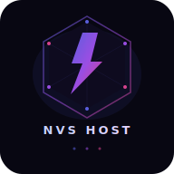

# NovaSpark V12 — Advanced Bot Hosting Platform

<p align="center">
  
</p>

Next-gen WhatsApp/Discord bot hosting with real-time dashboard, auto-config detection, coin economy, Stripe-ready billing, and a full suite of advanced hosting features.

## What's New in V12.0

- **Bot Analytics & Metrics** — Real-time CPU, RAM, uptime tracking with historical data, error rates, and hourly activity charts per bot.
- **Team Collaboration** — Create teams, invite members with role-based access (owner/admin/developer/viewer), share bots across teams.
- **Scheduled Tasks (Cron)** — Automate bot actions: restart, stop, backup, clear logs, or fire webhooks on any cron schedule.
- **Bot Marketplace** — Browse, publish, rate, and one-click deploy community bot templates. Categories, search, and reviews built-in.
- **Webhook Integrations** — Get notified about bot events (crash, deploy, health) via Discord, Slack, or custom HTTP endpoints. Auto-disable after failures.
- **Custom Domain Mapping** — Map your own domains to bots for webhook callbacks, with DNS verification and SSL support.
- **Automated Backups** — One-click backup/restore for bot files and config. Auto-prunes old backups. Excludes node_modules.
- **Bot Versioning & Rollback** — Every deploy tracked as a version. View deploy history and instantly rollback to any previous version.
- **Professional Logo & Branding** — New SVG logo with favicon and PWA icons.

## Previous Features (V11.x)

- **Auto-Config Detection** — Paste a GitHub URL and the platform auto-reads `novaspark.config.json`, `.env.example`, or `package.json` to pre-fill your deploy form.
- **Fixed Deploy Button** — Deploy now properly creates the bot, clones the repo, installs deps, and starts the process with full error reporting.
- **Advanced Deploy Settings** — Server tier, auto-restart toggle, max RAM, custom install commands.
- **Crash Protection** — Global error boundaries on both frontend and backend.
- **Better Error UX** — Deploy errors shown inline with clear messages.
- **Coin Economy** — Earn and spend coins, daily rewards, referral system, leaderboard.
- **Bot Templates** — Pre-built WhatsApp bot templates for one-click deploy.

## Bot Config Auto-Read

Users deploying bots can add a `novaspark.config.json` to their repo root:

```json
{
  "name": "My Bot",
  "description": "A WhatsApp bot with 130+ commands",
  "entry_point": "index.js",
  "branch": "main",
  "server_tier": "basic",
  "auto_restart": true,
  "max_ram_mb": 512,
  "env": {
    "BOT_TOKEN": { "description": "Your bot token", "required": true },
    "PREFIX": { "description": "Command prefix", "required": false, "default": "!" }
  }
}
```

## Deploy

### On Render (recommended)

1. Fork this repo
2. Create a new Web Service on [Render](https://render.com/)
3. Connect your forked repo
4. Set environment variables from `.env.example`
5. Deploy — the platform auto-starts

### Local Development

```bash
cp .env.example .env  # Edit .env with your secrets
npm install
npm run dev
```

## Stack

- **Backend:** Node.js 22+, Express, SQLite (built-in `node:sqlite`), WebSocket
- **Frontend:** Vanilla JS SPA, Tailwind CSS, Remix Icons
- **Auth:** JWT with refresh tokens, optional 2FA (TOTP)
- **Bot Engine:** Process isolation, auto-restart with exponential backoff, health watchdog
- **New in V12:** Analytics engine, team/RBAC system, cron scheduler, marketplace, webhook delivery, domain management, backup/restore, versioning

## API Endpoints

### Core

| Method | Path | Description |
|--------|------|-------------|
| POST | /api/auth/signup | Register |
| POST | /api/auth/login | Login |
| POST | /api/repo-config | Auto-detect bot config from GitHub |
| POST | /api/bots | Create a new bot |
| POST | /api/bots/:id/deploy | Clone + install + start |
| POST | /api/bots/:id/start | Start bot |
| POST | /api/bots/:id/stop | Stop bot |
| POST | /api/bots/:id/restart | Restart bot |
| GET | /api/bots/:id/logs | Get logs |
| GET | /api/health | Health check |

### Analytics (V12)

| Method | Path | Description |
|--------|------|-------------|
| GET | /api/analytics/overview | Account-wide analytics |
| GET | /api/analytics/:botId/metrics | Real-time bot metrics |
| GET | /api/analytics/:botId/analytics | Historical data (1h/6h/24h/7d/30d) |

### Teams (V12)

| Method | Path | Description |
|--------|------|-------------|
| POST | /api/teams | Create team |
| GET | /api/teams | List my teams |
| GET | /api/teams/:id | Team details + members |
| POST | /api/teams/:id/invite | Invite member |
| POST | /api/teams/join/:code | Join via invite code |
| DELETE | /api/teams/:id/members/:userId | Remove member |
| POST | /api/teams/:id/bots | Share bot with team |

### Scheduler (V12)

| Method | Path | Description |
|--------|------|-------------|
| POST | /api/scheduler | Create scheduled task |
| GET | /api/scheduler/bot/:botId | List tasks for bot |
| PUT | /api/scheduler/:id | Update task |
| DELETE | /api/scheduler/:id | Delete task |
| POST | /api/scheduler/:id/run | Execute task now |

### Marketplace (V12)

| Method | Path | Description |
|--------|------|-------------|
| GET | /api/marketplace | Browse marketplace |
| GET | /api/marketplace/:id | Get listing details |
| POST | /api/marketplace/publish | Publish bot template |
| POST | /api/marketplace/:id/review | Review/rate a bot |
| POST | /api/marketplace/:id/download | Get deploy info |

### Webhooks (V12)

| Method | Path | Description |
|--------|------|-------------|
| POST | /api/webhooks | Create webhook |
| GET | /api/webhooks | List my webhooks |
| PUT | /api/webhooks/:id | Update webhook |
| DELETE | /api/webhooks/:id | Delete webhook |
| POST | /api/webhooks/:id/test | Test webhook |

### Custom Domains (V12)

| Method | Path | Description |
|--------|------|-------------|
| POST | /api/domains | Add domain |
| GET | /api/domains | List my domains |
| POST | /api/domains/:id/verify | Verify domain DNS |
| DELETE | /api/domains/:id | Remove domain |

### Backups (V12)

| Method | Path | Description |
|--------|------|-------------|
| POST | /api/backups/:botId | Create backup |
| GET | /api/backups/:botId | List backups |
| POST | /api/backups/:botId/restore/:backupId | Restore backup |
| DELETE | /api/backups/:botId/backup/:backupId | Delete backup |

### Versioning (V12)

| Method | Path | Description |
|--------|------|-------------|
| GET | /api/versions/:botId | List deploy versions |
| GET | /api/versions/:botId/version/:versionId | Version details |
| POST | /api/versions/:botId/rollback/:versionId | Rollback to version |

## License

MIT
